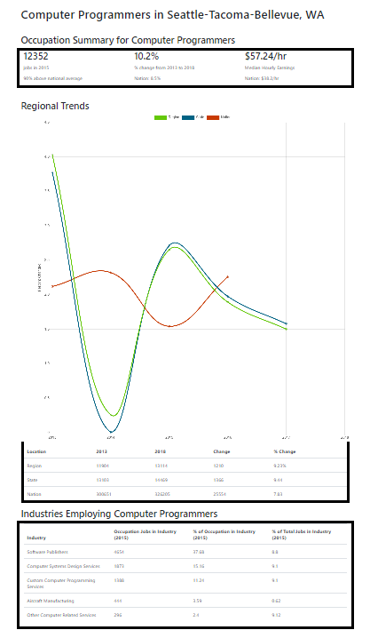

# Description
A web page showcasing job statistics within your local area compared to your state and the nation.
* [Live Site Here](https://emsi-job-stats.herokuapp.com/)

## Table of Contents
* [Installation](#installation)
* [Usage](#usage)
* [License](#license)
* [Contributing](#contributing)
## Installation
1. git clone repo
2. npm install from the Emsi-Project directory
3. npm start to run app on local host

## Usage

## License
* This project is licensed under: MIT
## Questions
Please contact me with any questions you may have using the links below!
  * [GitHub Profile](https://github.com/haydenrust1)
  * <haydenrust1@gmail.com>